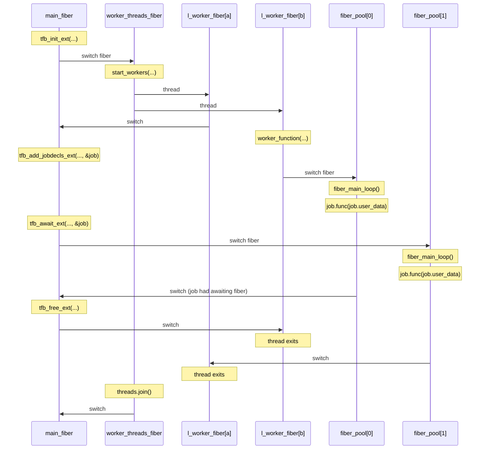

tinyfiber
============
A cooperative lightweight job-system with a C-api. This library uses a N:M mapping between working threads and fibers. You can have thousands of fibers running from a thread pool without ever have a kernel thread switch.

Online documentation: https://tinyfiber.readthedocs.io/

This library currently only supports Windows.

```cpp
#include "tinyfiber.h"

void job(void* param);

int main(int argc, const char* argv[])
{
    tfb_init();
    std::atomic_int64_t depth = 3;
    job(&depth);
    tfb_free();
}

void job(void* param)
{
    std::atomic_int64_t* depth = (std::atomic_int64_t*)param;

    (*depth)--;

    if (*depth > 0)
    {
        // Add job
        TfbWaitHandle wh{};
        tfb_add_job(job, param, &wh);
        tfb_await(&wh);
    }
}
```

A fiber system is a way to switch thread without involving the kernel. This makes the switches fast with a low over-head. A fiber can be seen as a data structure containing the current execution context, i.e. the states of the registers and a stack, importantly this includes the instruction pointer.

A fiber switch will not change thread, which means that a working pool of threads can exchange fibers. This means that you can not trust local thread storage variables between yields; mutex and semaphores will not work. This also includes all 3:rd part library functions you may call. If your project needs to use TLS in a matter that is not compatible with these constraints I recommend that you consider UMS (User-Mode Scheduling) or C++20 coroutines instead.

# Diagram of internal switching

